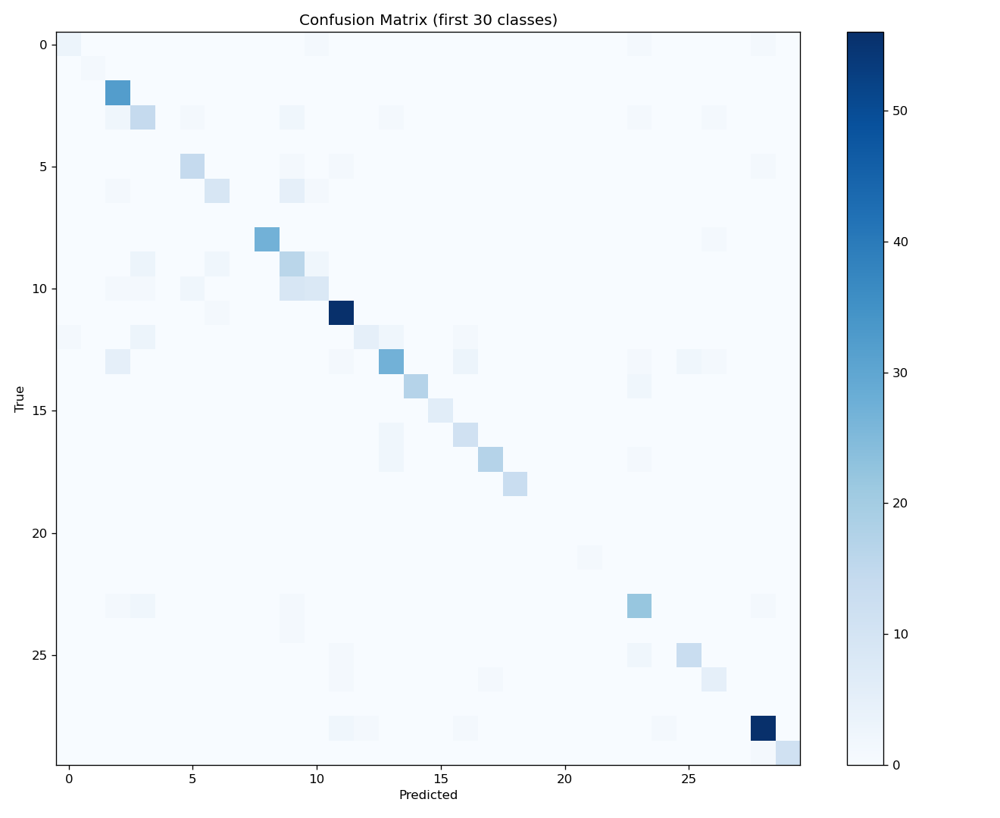
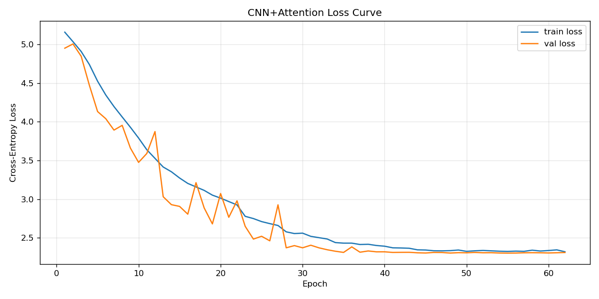

# Can Generative AI Improve Bioacoustic Classification?

**A controlled study on BirdCLEF 2026 with AudioLDM 2 synthetic augmentation — 206 species, 820,993 segments, and a negative result.**

The short answer: barely, and not where it is needed. Synthetic augmentation
moved Macro-F1 by +0.006 on a linear classifier and **−0.036** on a CNN
trained from scratch. Of the 43 rare classes the augmentation was built to
help, **31 produced no usable samples at all** — including every one of the
rarest.

The more useful result is why, and what turned out to matter instead.

> University of Waikato, COMPX525 · June 2026 · Solo project

---

## What was measured

A 2×2 design: two datasets (**A** original, **B** original + synthetic)
× two model families (classifier on frozen BirdNET embeddings, CNN with
attention pooling trained from raw audio). Splits, recording-level
evaluation and class-imbalance handling are held identical across A and B,
so any difference is attributable to the synthetic data rather than to the
pipeline.

| Model | Seg. Acc | Seg. Macro-F1 | **Rec. Acc** | **Rec. Macro-F1** |
|---|---|---|---|---|
| Logistic Regression | 0.636 | 0.547 | 0.869 | 0.800 |
| XGBoost | 0.640 | 0.555 | 0.874 | 0.794 |
| MLP on embeddings | 0.638 | 0.546 | 0.876 | 0.826 |
| CNN + attention (from scratch) | — | — | 0.608 | 0.542 |



The from-scratch CNN has learned genuine class structure — the diagonal is
clear, so it is not collapsing onto majority classes. But its errors
concentrate among acoustically similar species rather than scattering
randomly, which is the category-level explanation for the gap to the
pretrained embeddings.

---

## Three findings that outrank the research question

**1. Evaluation granularity beat every modelling choice.** Labels are given
per recording but training happens on 3-second segments, so most segments
carry a label for a call they do not contain. Aggregating segment
probabilities to the recording level before scoring lifted accuracy from
**0.64 to 0.87 — 23 points from one change in protocol**, larger than any
difference between classifiers or architectures. The bottleneck was
evaluation granularity and label noise, not model capacity.

**2. Downstream classifier complexity bought nothing.** Logistic regression,
XGBoost and an MLP land within 0.007 of each other at the recording level
(0.869 / 0.874 / 0.876). The predictive power sits in the pretrained
representation, not in what is stacked on top of it.

**3. Pretraining is worth 26 points.** The from-scratch CNN reaches 0.608
against 0.87 for frozen BirdNET embeddings, on ~28,000 training recordings.
Recording-level Top-5 accuracy for the embedding classifiers reaches 0.956.

---

## Why the augmentation failed

Not a prompt problem, and the ablation is what shows it.

| Prompt design | Pass rate |
|---|---|
| Scientific species name | ~0% |
| Generic ("a bird call") | very low |
| Acoustic description | **0.6%** (best) |
| Rich (name + call type + ecoregion) | 0.33% |

Every configuration sits on the floor. Adding semantic information made it
*worse*. If prompt engineering could solve this, at least one configuration
should have separated from the others; none did. **The bottleneck is what
the generator was ever exposed to** — AudioLDM 2 is trained on AudioSet,
WavCaps, AudioCaps and VGGSound, which contain common globally-distributed
birds and essentially no rare South American species.

18.7 hours of generation produced ~8,600 clips. 50 survived genus-level
verification by Perch 2.0.

**The inverse relationship.** Success rate tracks how well represented a
genus is in the generator's training data: jay 6%, tinamou 8%, rare regional
species ~0%. *The classes most in need of augmentation are precisely the
ones the generator cannot produce.*

Two usage strategies were tested rather than one, because the failure could
have been in the quality control rather than the generation:

- **Strict QC** — keep only Perch-verified clips. 50 kept. LogReg +0.006
  Macro-F1 (within noise); CNN **−0.036** (a flexible model fits the noisy
  synthetic labels).
- **Relabel by highest score** — keep all 8,670 clips, reassign each to
  Perch's top in-dataset class. **49% were relabelled as house sparrow.**
  Only ~0.1% retained their intended target species. The strategy does not
  create rare-species data; it redistributes generic bird calls into a few
  common classes.

Even with 26,010 synthetic segments — 170× the strict-QC set — LogReg moved
+0.003, *less* than the 50-sample version. Where synthetic data was most
abundant (house sparrow: 12,789 segments, 110 validation recordings),
ΔF1 = **−0.009**.

---

## An honest note on the CNN baselines

The from-scratch CNN's Group A result appears as 0.608, 0.590 and 0.580
across the three experiments in this repository. These are separate training
runs, and each comparison uses its own paired baseline. The ±0.03 spread is
itself informative: it is the run-to-run variance of training from random
initialisation on a single split, and it is why the **+0.055** Macro-F1
observed for the CNN under Strategy 2 is not claimed as a real gain — it
falls inside the noise band. A single split with one seed is the main
evaluation weakness here; repeated seeds with reported standard deviations
would be the first thing to fix.



Training and validation loss descend in parallel to ~2.0 / 2.18 with a
stable gap over 88 epochs — converged, not overfitting.

---

## Data work the numbers don't show

Before modelling, a targeted sample of recordings was listened to and
plotted as mel-spectrograms (`src/listen.py`) — the largest class, the
rarest classes, and the lowest quality-rated recordings. This surfaced two
label problems that no summary statistic would have:

- A frog recording (*Leptodactylus fuscus*) contains genuine croaks for ~28 s,
  then switches to **human speech** — the whole recording still carries the
  frog label.
- A recording labelled *Canis familiaris* is dominated by loud high-frequency
  bird-like calls; the dog barks are faint background. The recording-level
  label is not wrong, but most 3-second segments cut from it are.

It also explained the augmentation failure in advance. The two
single-recording classes — *Phyllomedusa sauvagii*, *Caiman yacare* — have
highly specific calls (bell-shaped croaks with upward sweeps; a descending
2 kHz→200 Hz "bubble") that are absent from general web-audio corpora. The
species most in need of synthetic data have the least representative
acoustics.

Other checks (`src/checkEmbedding.py`, `src/verify_stats.py`): BirdNET
embeddings verified for NaN/Inf/zero vectors and range; nearest-neighbour
label consistency at 0.477 against a 0.0098 random baseline (~48×),
confirming labels and embeddings are aligned. The 80/20 split
(`src/split_utils.py`) is grouped by recording filename so segments from one
recording never span train and validation.

---

## What else didn't work

- **Copying the leading solutions' spectrogram parameters.** Aligning
  `n_fft=2048, fmin=20` with published competition solutions *dropped*
  Macro-F1 from 0.608 to 0.560, both configurations fully converged. Those
  settings are tuned for large ImageNet-pretrained backbones; for a small
  CNN trained from scratch, higher-resolution input adds optimisation
  difficulty without adding capacity to exploit it. Best practice is not
  architecture-independent.
- **BirdNET as the QC validator** (`src/birdnet_qc.py`). Its non-avian
  coverage is thin, and 3 of the 43 target classes are frogs. Replaced by
  Perch 2.0 (`src/perch_qc.py`, ~14,795 iNaturalist classes).
- **Insect synthesis entirely.** Continuous broadband stridulation has no
  natural-language acoustic description that AudioLDM 2 responds to.
- **EfficientNet / NFNet from scratch, SED head with GeM pooling,
  multi-label BCE.** Considered and not pursued; reasons are logged in
  Appendix A of the report.

---

## Dataset

BirdCLEF 2026 (206 of 234 classes), from Kaggle. **Not redistributed here** —
see the competition page for access.

| | |
|---|---|
| Recordings | ~35,179 |
| 3 s segments | 820,993 |
| Classes | 206 (birds, plus frogs, insects, mammals, reptiles) |
| Largest class | 23,501 segments (*Micrastur semitorquatus*) |
| Smallest class | 5 segments, 1 recording (*Caiman yacare*) |
| Imbalance ratio | ~4,700:1 |

Because of the imbalance, **Macro-F1 is the primary metric** and the
early-stopping criterion; accuracy is reported only as an auxiliary figure.

---

## Repository

```
src/
  # data
  analyzeData.py            dataset statistics
  listen.py                 aural + mel-spectrogram audit
  audioprocess.py           audio loading and segmentation
  split_utils.py            recording-grouped 80/20 split
  extractEmbedding.py       BirdNET 1024-d embeddings
  checkEmbedding.py         embedding health check
  extract_optionB_emb.py    embeddings for synthetic audio (TFLite path)
  precompute_melspec.py     mel-spectrogram cache
  precompute_optionB_mel.py mel cache, relabelling strategy
  precompute_synth_mel.py   mel cache, synthetic audio

  # training
  train_classic.py          logistic regression on embeddings
  XG.py                     XGBoost on embeddings
  trainMLP.py               MLP on embeddings
  train_cnn_A_only.py       CNN + attention, Group A
  train_cnn_attn_cached.py  CNN + attention, cached mel-spectrograms
  train_cnn_groupB.py       Group B, strict QC
  train_groupB_optionB.py   Group B, highest-score relabelling

  # generation
  AudioLDM2.py              generation pipeline
  syth_generate.py          batch synthesis over target classes
  prompt_ablation.py        four prompt designs
  prompt_ablation_qc.py     pass rates per prompt design
  birdnet_qc.py             initial validator (superseded)
  perch_qc.py               Perch 2.0 validator

  # evaluation
  eval_recording.py         segment → recording aggregation
  verify_cosine.py          TFLite vs GUI embedding agreement (0.976–1.000)
  verify_stats.py           embedding sanity checks

scripts/exploration/        one-off probes kept for the record
figures/                    confusion matrices, loss curves, metric curves
results/class_synthesis_plan.csv
```

## Running

```bash
pip install -r requirements.txt
# download BirdCLEF 2026 data from Kaggle into data/

python src/extractEmbedding.py     # BirdNET embeddings
python src/train_classic.py        # Group A, sub-experiment 1
python src/train_cnn_A_only.py     # Group A, sub-experiment 2
python src/syth_generate.py        # AudioLDM 2 generation (~18.7 h)
python src/perch_qc.py             # quality control
python src/train_cnn_groupB.py     # Group B, strict QC
```

Model weights, mel caches and the Perch index are not committed — all are
regenerated by the scripts above.

---

## What I would do next

Pseudo-labelling, not generation. The negative result points directly at it:
using Perch to label unlabelled soundscapes yields *real* recordings of rare
species and sidesteps the generator's distribution bias entirely, and both
components (BirdNET embeddings, Perch validator) are already in this
pipeline. Beyond that: multi-label BCE using secondary species labels,
repeated seeds with reported variance, and fine-tuning Perch 2.0 rather than
training from scratch.
